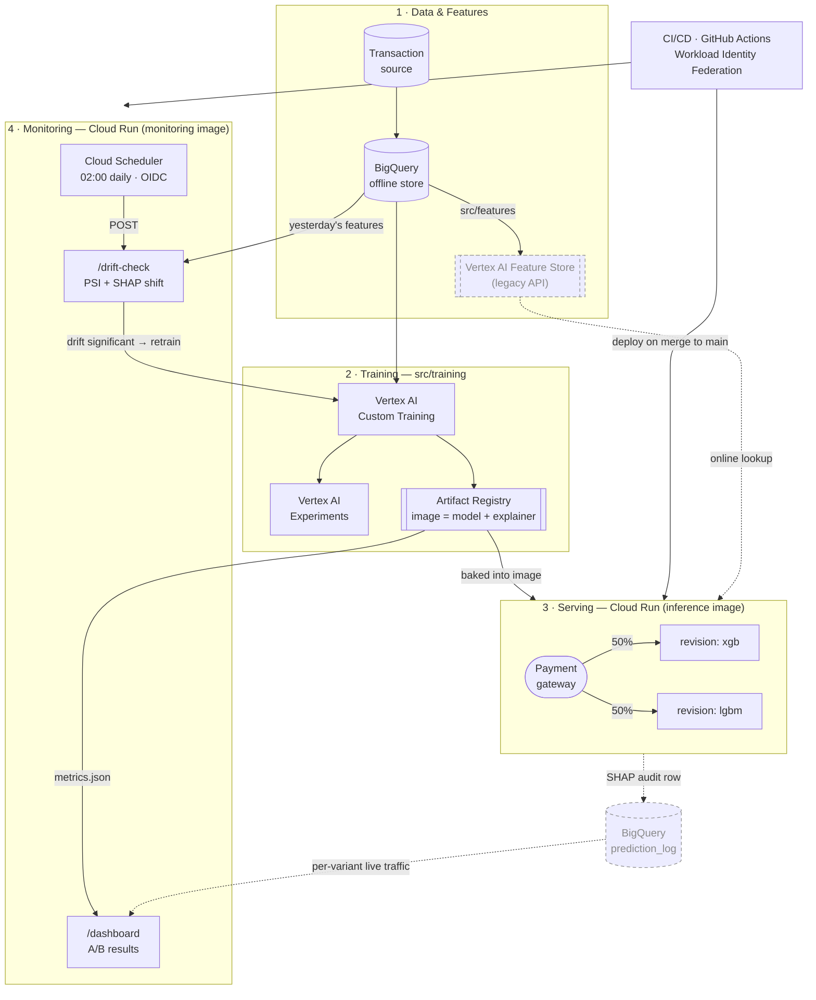

# GCP MLOps Pipeline — Real-Time Fraud Detection on Vertex AI

[](https://github.com/Milonahmed96/gcp-fraud-detection-mlops/actions/workflows/ci.yml)
[](https://www.python.org/downloads/release/python-3110/)
[](https://github.com/Milonahmed96/gcp-fraud-detection-mlops/actions/workflows/ci.yml)
[](https://cloud.google.com/run)

A production-grade, end-to-end MLOps pipeline that detects fraudulent card transactions in real time on Google Cloud. Raw transactions land in **BigQuery**, engineered features are served at low latency from the **Vertex AI Feature Store**, two model variants (**XGBoost** and **LightGBM**) are trained and versioned on **Vertex AI** with experiment tracking, and the resulting traffic split is served from a **FastAPI** service on **Cloud Run**. Every prediction carries a **SHAP** explanation logged to Vertex AI Experiments for auditability — a hard requirement in regulated financial services. A **Cloud Scheduler** job runs a daily drift check that can trigger retraining, and **GitHub Actions** deploys to Cloud Run on every merge to `main`. The two model variants run as a live **A/B test**, compared not just on AUC and F1 but on a business cost metric that prices false negatives (missed fraud) against false positives (blocked genuine customers).

---

## Architecture

Solid arrows are implemented and tested. **Dashed arrows are designed but not wired** — see [Known limitations](#known-limitations). A diagram that draws intent as if it were fact is a lie with better typography.



An editable [draw.io](https://app.diagrams.net) export lives at [`infrastructure/architecture.drawio`](infrastructure/architecture.drawio) — open it at app.diagrams.net via *File → Open from → Device*.

---

## Tech stack

| Component | Technology | Purpose |
|---|---|---|
| Offline feature store | BigQuery | Historical features, training sets, immutable audit log of predictions |
| Online feature store | Vertex AI Feature Store (managed) | Low-latency feature lookup at inference time |
| Training | Vertex AI Custom Training | Runs XGBoost and LightGBM jobs on managed compute |
| Experiment tracking | Vertex AI Experiments | Params, metrics, SHAP artefacts per run |
| Model registry | Vertex AI Model Registry | Versioned, promotable model artefacts |
| Inference API | FastAPI + Docker | Typed request/response schema, low-latency handler |
| Serving platform | Cloud Run | Scale-to-zero HTTP serving with native traffic splitting |
| A/B routing | Cloud Run revision traffic split | Splits live traffic between the XGBoost and LightGBM revisions |
| Explainability | SHAP (TreeExplainer) | Per-prediction feature attributions, logged for audit |
| Drift monitoring | Cloud Scheduler + custom job | Daily PSI / KS check against the training reference distribution |
| A/B dashboard | Inline SVG in a single HTML file | Zero-dependency result page; served at `/dashboard` on the monitor |
| CI/CD | GitHub Actions | Lint, pytest, build image, deploy to Cloud Run on merge to `main` |
| Models | XGBoost, LightGBM | The two A/B variants |
| Language | Python 3.11 | — |
| Packaging | uv | Fast, lockfile-backed dependency resolution |

---

## Repository structure

```
.
├── CLAUDE.md                   # Agent instructions + engineering conventions
├── project_context.md          # Living project state, decisions log, session handoff
├── README.md                   # You are here
├── pyproject.toml              # Metadata + dependencies. Core = inference only; extras: gcp, dev
├── uv.lock                     # Pinned, reproducible resolution
├── .python-version             # 3.11 — without this uv resolves 3.13
├── .env.example                # Placeholder GCP config — copy to .env, never commit .env
├── Dockerfile                  # Inference image (2.16 GB, no GCP SDKs)
├── Dockerfile.monitoring       # Drift-monitor image (needs the gcp extra)
├── .github/workflows/
│   ├── ci.yml                  # PR gate: lint, tests, build + run both containers
│   └── deploy.yml              # Deploy to Cloud Run on merge to main (WIF, no keys)
├── src/
│   ├── features/               # config, schema, causal transforms, BigQuery, Feature Store, sample data
│   ├── training/               # metrics, temporal split, model variants, train CLI, Vertex, experiments
│   ├── evaluation/             # SHAP explainer, experiment logging, A/B report + HTML dashboard
│   ├── inference/              # customer state, serving features, schemas, registry, FastAPI app
│   └── monitoring/             # PSI/KS drift, scheduled check, Cloud Scheduler, monitor service
├── tests/                      # Mirrors src/, plus tests/workflows/ which parses the CI YAML
├── notebooks/                  # EDA + experiment notebooks (never production code)
├── infrastructure/
│   ├── setup_gcp.sh            # One-time idempotent bootstrap: WIF, service accounts, registry
│   └── architecture.drawio     # Editable architecture diagram
├── artifacts/                  # gitignored — models, explainers, metrics.json, dashboard.html
└── data/
    └── sample/                 # 6,000 synthetic transactions — no real data, no credentials
```

---

## Quickstart

### Prerequisites

- A **Google Cloud account** with billing enabled (the free trial credit is sufficient for a full demo run)
- **[gcloud CLI](https://cloud.google.com/sdk/docs/install)**, authenticated: `gcloud auth login && gcloud auth application-default login`
- **[uv](https://docs.astral.sh/uv/getting-started/installation/)** for dependency management
- **Python 3.11**
- **Docker** (only needed to build the inference image locally)

### Setup

```bash
# 1. Clone
git clone https://github.com/Milonahmed96/gcp-fraud-detection-mlops.git
cd gcp-fraud-detection-mlops

# 2. Configure — copy the template and fill in your own GCP values
cp .env.example .env
$EDITOR .env

# 3. Point gcloud at the same project
gcloud config set project YOUR_GCP_PROJECT_ID

# 4. Install dependencies into a managed virtualenv
uv sync
```

`.env` is gitignored and must never be committed. Every GCP identifier is read from the environment via `python-dotenv` — nothing is hardcoded.

### Required environment variables

| Key | Example | Notes |
|---|---|---|
| `GCP_PROJECT_ID` | `fraud-detection-mlops` | Your project ID, not the display name |
| `GCP_REGION` | `europe-west2` | London — keeps data residency in the UK |
| `GCP_BUCKET_NAME` | `fraud-mlops-artifacts` | GCS bucket for model artefacts and staging |
| `VERTEX_AI_ENDPOINT` | `projects/.../endpoints/...` | Populated after the first deploy |
| `BIGQUERY_DATASET` | `fraud_features` | Offline store + prediction audit log |
| `FEATURE_STORE_ID` | `fraud_online_store` | Vertex AI Feature Store instance |
| `CLOUD_RUN_SERVICE_NAME` | `fraud-inference-api` | Target service for CI/CD deploys |

### Running locally

```bash
# Run the test suite (must pass before any merge)
uv run pytest

# Train both A/B variants locally against the committed sample — no GCP needed
uv run python -m src.training.train --backend local

# Or submit the same script as a Vertex AI Custom Training job (requires .env + gcloud auth)
uv run python -m src.training.train --backend vertex --source bigquery \
    --start-date 2024-01-01 --end-date 2024-03-01

# Regenerate the synthetic sample data
uv run python -m src.features.sample_data

# Serve the inference API locally on :8080 (needs the artefacts from the step above)
uv run uvicorn src.inference.app:app --reload --port 8080

# Run the drift check against the sample, without triggering a retraining job
uv run python -m src.monitoring.monitor --source sample --dry-run

# Build and run the container exactly as Cloud Run will
docker build -t fraud-inference-api .
docker run --rm -p 8080:8080 -e SERVING_VARIANT=xgboost fraud-inference-api
```

Dependencies are split so the serving image stays lean. `uv sync` installs only what inference needs; add extras for everything else:

```bash
uv sync                            # inference only — what the Docker image installs
uv sync --extra gcp --extra dev    # + BigQuery/Vertex SDKs + pytest/ruff (what CI uses)
```

### Scoring a transaction

```bash
curl -X POST localhost:8080/predict -H 'Content-Type: application/json' -d '{
  "transaction_id": "txn_001", "customer_id": "c_000",
  "timestamp": "2024-03-01T03:15:00", "amount": 4800.0,
  "merchant_id": "m_012", "merchant_category": "electronics",
  "country": "RO", "customer_home_country": "GB", "card_present": false }'
```

```json
{
  "transaction_id": "txn_001", "variant": "xgboost",
  "fraud_probability": 0.9945, "threshold": 0.5039, "is_flagged": true,
  "base_value": 1.7425, "latency_ms": 8.97, "new_customer": false,
  "top_features": [
    {"feature": "amount_vs_customer_mean",  "value": 46.41,  "shap_value":  3.074, "direction": "toward_fraud"},
    {"feature": "is_foreign",               "value": 1.0,    "shap_value":  1.607, "direction": "toward_fraud"},
    {"feature": "seconds_since_prev_txn",   "value": 85936,  "shap_value": -1.463, "direction": "toward_genuine"},
    {"feature": "customer_amount_mean_prior","value": 103.44,"shap_value": -1.335, "direction": "toward_genuine"},
    {"feature": "card_not_present",         "value": 1.0,    "shap_value":  1.307, "direction": "toward_fraud"}
  ]
}
```

The same request for a domestic, card-present, £42 afternoon purchase scores `0.0011` and is not flagged. Handler latency is **6–13 ms including the SHAP explanation** — measured locally and in the container.

Note the threshold is `0.5039`, not `0.5`. It is the cost-minimising threshold fitted on the validation split and read from `artifacts/metrics.json`; the service refuses to start rather than silently default it.

```bash
# Serve the drift monitor + A/B dashboard on :8081
MODEL_ARTIFACTS_DIR=artifacts DRIFT_SOURCE=sample \
  uv run uvicorn src.monitoring.app:app --port 8081
# then open http://localhost:8081/dashboard
```

---

## GCP cost breakdown

For a **typical dev/demo month** in `europe-west2`: one training cycle per variant, two Cloud Run services on light demo traffic, and a daily drift check.

I have separated what I could verify against Google's published documentation from what I could not. **Nothing here came from a metered bill** — no GCP resource has been provisioned (see [Known limitations](#known-limitations)).

### Verified against Google's docs

| Service | Free allowance | Source |
|---|---|---|
| Cloud Run | 2,000,000 requests, 180,000 vCPU-seconds, 360,000 GiB-seconds per month | [Cloud Run pricing](https://cloud.google.com/run/pricing) |
| BigQuery | 10 GiB storage + 1 TiB queries per month | [BigQuery pricing](https://cloud.google.com/bigquery/pricing) |
| Cloud Scheduler | 3 jobs per month | [Scheduler pricing](https://cloud.google.com/scheduler/pricing) |

Both Cloud Run services scale to zero (`--min-instances=0`) and the drift check runs once daily. At demo traffic this project's Cloud Run, BigQuery, and Scheduler usage sits **inside the free tier**.

### Estimated, not verified

These rates change by region and over time, and the pricing pages are JavaScript-rendered so I could not extract them programmatically. Treat them as order-of-magnitude, and check the [Pricing Calculator](https://cloud.google.com/products/calculator) before relying on them.

| Service | Assumption | Rough cost |
|---|---|---|
| Vertex AI Custom Training | 2 jobs × ~20 min on `n1-standard-4` | cents per training cycle |
| Vertex AI Feature Store (legacy) | 1 online serving node, provisioned continuously | **the dominant cost** — a node bills whether or not anything reads from it |
| Artifact Registry | ~5 GB of images (2.16 GB inference + 2.67 GB monitoring) | low single-digit dollars |
| Cloud Storage | ~1 GB of artefacts | negligible |
| Vertex AI Experiments | Metadata only | metadata is free; artefacts bill as GCS |

**The single biggest cost lever is the Feature Store online node**, which bills continuously. Tear it down when not demoing:

```bash
gcloud ai feature-stores delete "$FEATURE_STORE_ID" --region="$GCP_REGION"
```

The second lever is image size. Cloud Run bills cold-start time, and the inference image is 2.16 GB — already 510 MB smaller than it would be if the GCP SDKs were not confined to the `gcp` extra.

The project is designed to fit inside the GCP free trial credit, but *designed to* is not *measured at*.

### ⚠️ The Feature Store API this project uses is deprecated

`src/features/feature_store.py` calls `aiplatform.Featurestore.create(...)` with `EntityType` and `Feature` resources. That is **Vertex AI Feature Store (Legacy)**. Google now publishes a [migration guide to Bigtable](https://docs.cloud.google.com/bigtable/docs/migrate-vertex-ai-legacy-bigtable), and the related *Optimized online serving* path is on a published sunset timeline: no new features from **17 May 2026**, APIs removed on **17 February 2027**.

Two consequences worth stating plainly:

1. **Anyone reading this repo as a reference should not copy that module verbatim.** The modern approach makes Feature Store a metadata layer over a BigQuery source, or drops it for Bigtable online serving directly.
2. **It does not currently break anything**, because — as the architecture diagram shows with a dashed edge — the serving path never calls the Feature Store. It uses `InMemoryStateStore`. The migration is a genuine piece of outstanding work, not a hidden landmine.

Sources: [Vertex AI pricing](https://cloud.google.com/vertex-ai/pricing) · [Migrate from Vertex AI Feature Store (Legacy) to Bigtable](https://docs.cloud.google.com/bigtable/docs/migrate-vertex-ai-legacy-bigtable) · [Feature Store online serving types](https://docs.cloud.google.com/vertex-ai/docs/featurestore/latest/online-serving-types)

---

## A/B testing

Both variants are trained on identical features and identical train/test splits, so the only meaningful difference between them is the learning algorithm. Cloud Run's native revision traffic splitting sends a configurable share of live requests to each — starting at 50/50 — and every prediction is written to BigQuery tagged with the serving variant, enabling honest offline comparison on real traffic.

| Variant | Model | Cloud Run revision |
|---|---|---|
| A | XGBoost | `fraud-inference-api-xgb` |
| B | LightGBM | `fraud-inference-api-lgbm` |

Metrics compared:

- **ROC-AUC** — ranking quality, robust to the extreme class imbalance typical of fraud data
- **PR-AUC** — the more honest headline metric when positives are <1% of rows
- **F1 / precision / recall at the operating threshold** — what the fraud ops team actually feels
- **Business cost metric** — the metric that decides the winner:

  ```
  cost = (false_negatives × mean_fraud_value) + (false_positives × cost_of_blocking_genuine_customer)
  ```

  A missed fraud costs the chargeback. A false positive costs a declined transaction and some goodwill. These are not symmetric, so accuracy-flavoured metrics alone pick the wrong model. The variant with the **lower expected cost per 1,000 transactions wins**, and the decision is reported with a bootstrap confidence interval rather than a bare point estimate.

- **p50 / p95 / p99 latency** — a model that wins on cost but blows the latency budget doesn't ship

### Result from a real Vertex AI training job

Trained on `n1-standard-4`, reading the feature table from BigQuery, artefacts written to GCS via the `/gcs` FUSE mount:

| Variant | ROC-AUC | PR-AUC | F1 | Cost / 1k txns | FP | FN |
|---|---|---|---|---|---|---|
| XGBoost | 0.760 | 0.430 | 0.487 | **843.65** | 6 | 13 |
| LightGBM | 0.729 | 0.401 | 0.452 | 1017.40 | 2 | 15 |

Delta `−173.75` per 1,000, 95% bootstrap interval `[−460.00, +25.10]` — **straddles zero, so not significant.** XGBoost is cheaper, but the pipeline reports the comparison as inconclusive and keeps the incumbent rather than shipping a coin flip.

Note LightGBM blocks only **2** customers to XGBoost's **6**, yet costs more — because it misses **15** frauds to XGBoost's **13**. Fewer false positives, more money lost. A symmetric metric hides exactly that.

### Current result (local run, synthetic sample)

Reproduce with `uv run python -m src.training.train --backend local`:

| Variant | ROC-AUC | PR-AUC | F1 | Cost / 1k txns | FP | FN |
|---|---|---|---|---|---|---|
| XGBoost | 0.754 | 0.413 | 0.444 | **984.69** | 6 | 14 |
| LightGBM | 0.729 | 0.401 | 0.452 | 1017.40 | 2 | 15 |

Two things worth noticing. **LightGBM wins on F1 but loses on cost** — precisely the disagreement the business metric exists to expose, since F1 treats a missed fraud and a blocked customer as equally bad. And the bootstrap interval for the cost difference is `[-143.96, +29.17]`, which **straddles zero**: on this test set the two variants are statistically indistinguishable. The pipeline therefore reports the result as *not significant* and keeps the incumbent rather than shipping a coin flip.

These numbers come from the synthetic sample, whose difficulty is calibrated by a deliberate stealth-fraud cohort (35% of fraud carries no distinguishing signal). That caps achievable recall, which is why ROC-AUC sits near 0.75 rather than 1.0 — an honest ceiling rather than a leaky one.

### The dashboard

```bash
uv run python -m src.evaluation.dashboard      # writes artifacts/dashboard.html
```

Also served at `GET /dashboard` on the drift-monitor service — an operator surface, and it needs *both* variants' metrics, whereas an inference revision only knows the variant it serves.

The page is a single self-contained HTML file: **no JavaScript, no CDN, no chart library**, inline SVG only. It renders from a `file://` URL, inside a locked-down Cloud Run service, and as an email attachment.

Three choices worth defending, because a dashboard that misleads is worse than none:

- **The headline is the verdict, not the winner.** When the interval straddles zero the hero slot reads *"No significant difference"*. A reader who skims must not come away believing a coin flip was a result.
- **Two scales, two charts — never a dual axis.** Ranking metrics (0–1) and cost per 1,000 (currency) get separate charts.
- **The two SHAP panels share one scale.** Normalising each panel to its own maximum would have drawn LightGBM's top feature (0.73) as long as XGBoost's (1.43), inviting exactly the cross-panel comparison the side-by-side layout encourages. This was caught by rendering the page and looking at it, not by reading the code.

Every bar carries a direct value label and a table view is provided, because the aqua series sits below 3:1 contrast on the light surface — colour alone never carries a value. The categorical palette was checked with a CVD validator (worst adjacent ΔE 73.6) rather than chosen by eye, and dark mode is a selected set of steps for the dark surface, not an automatic inversion.

The dashboard also states, in its own footer, that its numbers are offline-only and that serving latency is unavailable — see *Known limitations*.

---

## SHAP explainability

Regulated lenders must be able to explain adverse automated decisions. Every prediction returns, alongside its fraud probability, the top contributing features and their signed SHAP attributions.

- `shap.TreeExplainer` is used for both variants — exact for tree ensembles and fast enough to sit in the request path. Both A/B variants being tree ensembles is a genuine constraint on the variant choice, not a coincidence
- The explainer is built once at training time and shipped as a model artefact (`artifacts/explainer_<variant>.joblib`), so no explainer construction happens per request
- Per-prediction attributions are returned in the `/predict` response, and global importance per training run is logged to **Vertex AI Experiments**
- A **BigQuery `prediction_log`** table and its writer exist for the queryable audit trail — *why was transaction `X` blocked on date `Y`?* — but the serving path does **not yet call it**. Wiring that write requires a non-blocking background task so the request is not delayed; see *Known limitations*
- Global feature importance (mean absolute SHAP) is recomputed each training run and compared against the previous run via `importance_shift` — a large shift in what drives the model is itself a drift signal, and Phase 6's monitor watches it alongside the feature distributions

### Two things the implementation gets right

**Attributions live in log-odds space, not probability space.** SHAP's additivity guarantee is `base_value + Σ shap_values == raw margin` (the ensemble's pre-sigmoid output). Summing attributions and expecting a probability is a common, silent error. `Explanation` names the space it is in, and `verify_additivity` asserts the identity to a `1e-4` tolerance against the model's own raw margin.

**The shape of `shap_values` is not stable across shap versions or model types.** Some releases return a two-element list (one array per class) for LightGBM binary classifiers; some return `(n, n_features, 2)`; current ones return `(n, n_features)`. Taking the wrong element inverts the sign of every explanation and *nothing raises*. `normalise_shap_values` collapses all three shapes onto the positive class, and the test suite covers each.

### Example: a real explanation

For the highest-scoring true fraud in the test set (`p = 0.999`):

| Feature | Value | SHAP | Direction |
|---|---|---|---|
| `is_foreign` | 1.00 | **+2.682** | toward fraud |
| `amount_vs_customer_mean` | 4.16 | **+2.252** | toward fraud |
| `card_not_present` | 1.00 | **+1.539** | toward fraud |
| `amount_sum_24h` | 226.05 | −0.782 | toward genuine |
| `day_of_week` | 1.00 | −0.631 | toward genuine |

A foreign, card-not-present transaction at 4.16× that customer's own spending baseline. Note that exculpatory features are surfaced too — `top_contributions` ranks by *absolute* effect, because an auditor asking "why was this blocked?" needs the evidence that argued against the decision as well.

Globally, `amount_vs_customer_mean` is the strongest driver (mean |SHAP| 1.42), ahead of `amount_log` (1.08) and `amount_sum_24h` (1.08) — the model relies most on spending *relative to the customer's own baseline* rather than on raw transaction size, which is the behaviour a fraud analyst would want.

---

## Inference service

A FastAPI app on Cloud Run. **One revision per model variant**, selected by the `SERVING_VARIANT` environment variable; Cloud Run's native revision traffic splitting performs the A/B allocation, so there is no routing logic in application code and no shared mutable state between variants.

| Endpoint | Purpose |
|---|---|
| `GET /health` | Readiness probe. Returns 503, with the reason, if artefacts failed to load |
| `POST /predict` | Score one transaction; returns probability, decision, and SHAP top-5 |

The model, the SHAP explainer, and the trained threshold load once at startup. A startup failure is *recorded*, not raised — the process stays up so `/health` can tell an operator why it is unhealthy, rather than handing Cloud Run a crash loop.

### Defeating train/serve skew

This is the hard part of real-time ML, and it gets its own module (`src/inference/state.py`) and its own test file (`tests/inference/test_skew.py`).

Offline, features are engineered over a whole history with pandas rolling windows. Online, there is one transaction and a Feature Store lookup. These are two implementations of the same function, and if they disagree the model receives inputs it never trained on — silently, with offline metrics still looking healthy.

The naive design, storing precomputed window aggregates in the Feature Store, does not work: a trailing 24h window depends on *when you ask*, and the stored value was computed when the customer last transacted. It goes stale by exactly the inter-transaction gap, which is precisely when velocity matters. So the online store holds the customer's **recent event log**, and the windows are computed against the incoming transaction's own timestamp.

`test_skew.py` replays 150 sample transactions through both paths and asserts every one of the 13 features matches exactly, including dtype. Two real bugs surfaced this way:

- **Microsecond truncation.** `pd.Timedelta.total_seconds()` inherits `datetime.timedelta`'s microsecond resolution, so `seconds_since_prev_txn` came out as `220.472044` where training saw `220.472044709`. Fixed by dividing nanoseconds directly.
- **A half-open window.** pandas rolling uses `(t − w, t]`, so an event *exactly* one hour old is excluded. The obvious `<=` would have been wrong on exactly the high-velocity transactions the feature exists to catch.

The customer state lookup is also causal: `lookup(customer_id, as_of=event_time)` never returns the transaction being scored, nor anything after it — which protects against a duplicated or late-arriving write in production, not just historical replay.

### Container

Multi-stage build on `python:3.11-slim`, running as a non-root user. `libgomp1` is installed explicitly — both XGBoost and LightGBM link against OpenMP, and without it `import lightgbm` fails at startup with an opaque loader error.

Because every GCP call in this repo is lazy-imported, the BigQuery and Vertex AI SDKs live in an optional `gcp` extra and never enter the serving image, cutting it from **2.67 GB to 2.16 GB**. Cloud Run charges cold-start time against image size.

---

## Drift monitoring

Fraud labels arrive weeks late — a chargeback is not instant — so production AUC is not observable in time to act on. Drift detection is therefore **unsupervised**: it compares the distribution of features the model is *currently seeing* against the distribution it was *trained on*.

Two independent signals, answering different questions:

| Signal | Question | Gates retraining? |
|---|---|---|
| **PSI** per feature | Has the input distribution moved? | **Yes** — any feature ≥ 0.25 |
| **KS** two-sample | Same, but sensitive to shifts coarse bins hide | No — its p-value collapses with sample size |
| **SHAP `importance_shift`** | Has *what drives the model* changed? | No — reported for a human |

Drift is `any(feature significant)`, not a mean. One feature moving hard is exactly the fraud-ring signature; averaging it across thirteen stable features would hide it.

### Binning is where PSI implementations quietly break

`is_night` is a bool. `txn_count_1h` is almost always 1. Hand either to a quantile binner and you get duplicate edges, empty bins, and a `log(0)` that surfaces as `inf` or `nan` rather than an error — a monitor that silently never fires. So:

- Features with ≤ 10 distinct values (and all bools) are treated as **categorical**, not quantile-binned.
- Outer bin edges are **infinite**, so a value beyond the training range lands in a bin instead of vanishing and deflating the PSI.
- A category never seen in training is folded into the smallest reference bin — new behaviour is drift, not an error.
- Every proportion is floored at `EPSILON` before any logarithm.

The reference profile (`artifacts/reference_profile.json`) is captured from the **training split** — the distribution the model actually learned — not from test, which it never saw.

### Verified behaviour

```bash
uv run python -m src.monitoring.monitor --source sample --dry-run
```

Against its own training distribution, the monitor is quiet — which matters more than catching drift, because a monitor that pages someone nightly gets muted:

```
stable: 0/13 features drifted significantly; worst customer_amount_mean_prior psi=0.0113 (n=6000)
explanation drift (SHAP importance shift): 0.0111
```

Simulating a fraud ring (traffic goes foreign, card-not-present, 20× the customers' baselines, at 03:00):

```
DRIFT: 6/13 features drifted significantly; worst is_foreign psi=15.4015 (n=1500)
explanation drift (SHAP importance shift): 0.2165
  is_foreign psi=15.4015 (significant)
  hour_of_day psi=12.7174 (significant)
  card_not_present psi=11.9003 (significant)
  amount_vs_customer_mean psi=6.4754 (significant)
  ...
drift detected; retraining SKIPPED (--dry-run)
```

### Deployment shape

Cloud Scheduler fires an authenticated POST at a **separate Cloud Run service** (`Dockerfile.monitoring`), not at the inference API. Two concrete reasons: the inference image has no BigQuery SDK — that is what keeps it 500 MB smaller — and a minutes-long batch job must not share a request pool or scale-to-zero policy with a 10 ms latency-critical endpoint.

```
Cloud Scheduler ──(OIDC, 02:00 daily)──▶ Cloud Run: /drift-check
                                              │
                                              ├─ PSI vs reference_profile.json
                                              ├─ SHAP importance_shift
                                              └─ if drifted → Vertex AI retraining job
```

Authentication is an **OIDC token** minted for a service account, with the audience set to the bare service URL (Cloud Run rejects a token whose audience carries the request path). No API key lives in the job definition. Provisioning via `ensure_drift_check_job` is idempotent — it creates or updates in place, so a redeploy neither fails with `AlreadyExists` nor leaves a stale schedule behind.

A retraining submission failure is logged, never raised: a 5xx would make Cloud Scheduler retry, and a retry storm here means a thundering herd of Vertex AI training jobs.

---

## CI/CD

Two workflows. `ci.yml` is the PR gate; `deploy.yml` calls it as a reusable workflow, so **`main` can never deploy code that has not passed the same gate a pull request does.**

**`ci.yml` — on PR into `develop` or `main`:**
1. `ruff check` + `ruff format --check`
2. Full pytest suite (installs `--extra gcp`; without it the suite cannot import `bigquery.SchemaField`)
3. Train the models — both Dockerfiles `COPY artifacts/`, so the images cannot be built without a training run
4. Build both images (no push)
5. **Run both containers and hit them.** `/health` must return `"status":"ok"`, and `/predict` must flag a known-fraudulent transaction. Proving an image *assembles* is not proving it *serves*.

**`deploy.yml` — on merge to `main`:**
1. Everything above, via `workflow_call`
2. Build and push both images to Artifact Registry, tagged with the commit SHA
3. Deploy **two revisions** of the inference service — one per A/B variant, differing only in `SERVING_VARIANT` — both with `--no-traffic`
4. Smoke-test each revision on its own `--tag` URL, which receives no production traffic
5. Only then `update-traffic --to-tags=xgb=50,lgbm=50`
6. Deploy the drift monitor and provision its Cloud Scheduler job

### The rollback strategy is the ordering

There is no rollback step, because traffic never moves until the smoke test passes. If a new revision is unhealthy the job stops at step 4 and the previous revision continues serving 100%. A rollback you never have to execute is the only kind that reliably works.

`concurrency: deploy-main` with `cancel-in-progress: false` prevents two deploys racing for the same traffic split.

### No keys, anywhere

Authentication is **Workload Identity Federation**: GitHub Actions presents its OIDC token and GCP mints short-lived credentials. No service-account JSON key exists in the repository, in GitHub secrets, or on disk. `infrastructure/setup_gcp.sh` bootstraps this once, and its WIF provider carries an `attribute-condition` pinning it to this repository — without that condition, *any* GitHub repo on the internet could mint tokens for the service account.

Two footguns worth naming, both caught before they could fail a real deploy:

- **A federated credential cannot mint an ID token, and neither can impersonation.** `gcloud auth print-identity-token` fails under WIF; `--impersonate-service-account` fails too. The smoke test uses `google-github-actions/auth` with `token_format: id_token`, which asks Google's STS directly.
- **The ID token's audience must be the *base* service URL**, not the tagged revision URL — even though the tagged URL is the thing being called. Proven by probe on a live deploy:
  ```
  probing https://xgb---fraud-inference-api-….a.run.app/health
    audience=tagged -> HTTP 401  "the access token could not be verified"
    audience=base   -> HTTP 200
  ```
- **`--no-traffic` is rejected when *creating* a Cloud Run service.** The flag applies only from the second deploy onward; a service with no revisions has no live traffic to protect.
- **Cloud Scheduler's OIDC audience must also be the bare service URL**, not the URL with `/drift-check` appended.

`tests/workflows/test_workflows.py` parses both YAML files and asserts these invariants — no `credentials_json`, `id-token: write` present, deploy `needs: verify`, smoke-test index before `update-traffic`, every action pinned rather than floating on `@main`. A broken workflow should fail the test suite, not the deploy.

---

## Project status

| Phase | Scope | Status |
|---|---|---|
| 1 | Repository scaffold + documentation | ✅ Complete |
| 2 | Data ingestion + feature engineering | ✅ Complete |
| 3 | Model training on Vertex AI | ✅ Complete |
| 4 | SHAP explainability module | ✅ Complete |
| 5 | FastAPI inference service | ✅ Complete |
| 6 | Drift monitoring | ✅ Complete |
| 7 | GitHub Actions CI/CD | ✅ Complete |
| 8 | A/B test dashboard | ✅ Complete |
| 9 | Final polish + `v1.0.0` tag | ✅ Complete |

**604 tests** pass on every push; CI is green on `main`. See `project_context.md` for the decisions log.

---

## Known limitations

Stated plainly, because a portfolio project that hides its gaps teaches the reader nothing.

- **The Vertex AI Feature Store has never been provisioned.** It is the one component that bills continuously (~$0.90/node-hour) for a capability the serving path does not use. Everything else in this repo has now run against a live GCP project — see *What the first live run found* below.
- **The serving path does not write to `prediction_log`.** The table schema and the writer both exist and are tested; `app.py` never calls them. Doing so needs a BigQuery client on the serving path and a background write so latency is unaffected — and the inference image deliberately excludes the BigQuery SDK, so the cleaner route is structured logging to Cloud Logging with a BigQuery sink.
- **The A/B result on the sample is not statistically significant.** XGBoost costs less per 1,000 transactions than LightGBM, but the bootstrap interval straddles zero. The pipeline reports this honestly and keeps the incumbent rather than shipping a coin flip.
- **`InMemoryStateStore` reads the committed CSV.** The real Vertex AI Feature Store reader satisfying `lookup(customer_id, as_of)` is not written. The interface exists so the swap is local.
- **The Feature Store module targets a deprecated API.** `aiplatform.Featurestore` is Vertex AI Feature Store (Legacy); its Optimized online serving path is sunset on 17 February 2027. Migration is outstanding work — see the cost section. It breaks nothing today only because the serving path does not call it.
- **The drift monitor compares the whole current batch** against the reference; windowing beyond `--start-date`/`--end-date` is not implemented.
- **Training data is synthetic.** Real fraud data is not publicly distributable at useful fidelity. The generator injects realistic correlations *and* a 35% stealth-fraud cohort that caps achievable recall, which is why ROC-AUC sits near 0.75 rather than an implausible 1.0.
- **Cost figures are estimates** from GCP's published pricing, not from a metered bill.

---

## Engineering conventions

- **GitFlow:** `main` (protected, production) ← `develop` (integration) ← `feature/*`
- **Conventional commits:** `feat:`, `fix:`, `chore:`, `docs:`, `refactor:`, `test:`
- **One logical change per commit.** No monolithic commits.
- **Tests accompany every `src/` module.** `pytest` must pass before any merge.
- **No credentials in git, ever.** All config flows through `.env` → `python-dotenv`.

Full detail in [CLAUDE.md](CLAUDE.md).

---

## What the first live run found

The project reached "604 tests passing, CI green, `v1.0.0` tagged" **before a single GCP resource had ever been created.** Every cloud call was tested against a fake client. Then it was provisioned for real, and the first live run found **nine defects that no test caught.**

| # | Defect | Why no test found it |
|---|---|---|
| 1 | BigQuery `TIMESTAMP` is microsecond-resolution; nanoseconds crash pyarrow | The fake client never serialised anything |
| 2 | `db-dtypes` is required by `to_dataframe()` and was never declared | Never called against a real result set |
| 3 | `CustomTrainingJob(script_path=…)` packages **one file**; `train.py` imports the whole `src` package | The fake never packaged anything |
| 4 | `python-dotenv` discovery walks up from the *calling module*, finding the repo's `.env` and defeating config-test isolation | CI has no `.env` |
| 5 | Cross-building a 2.7 GB image under QEMU takes over an hour | Only a wall-clock problem |
| 6 | **The training set never selected `amount`, so every missed fraud cost £0** | `_slice` silently fell back to `np.zeros(...)` |
| 7 | `--no-traffic` is rejected when *creating* a Cloud Run service | No test can know what an API will refuse |
| 8 | `gcloud auth print-identity-token --impersonate-service-account` fails under WIF | Same |
| 9 | The ID token's audience must be the **base** service URL, not the tagged revision URL | Same |

**Number 6 is the one that matters.** The cost-minimising threshold correctly concluded that blocking nobody is optimal when every false negative costs zero. ROC-AUC still read `0.7597`. The A/B dashboard would have reported a clean tie. A fraud model that never blocks fraud would have shipped, and every offline metric would have looked healthy:

```
before:  xgboost  roc_auc=0.7597  f1=0.1667  cost/1k=0.00     (fp=0  fn=20)
after:   xgboost  roc_auc=0.7597  f1=0.4865  cost/1k=843.65   (fp=6  fn=13)
```

`_slice` now raises instead of substituting zeros. Two tests — one asserting `amount` be *excluded* from the feature table, one asserting the impersonation mechanism — turned out to be **encoding the bug rather than catching it.**

Three of the nine live in the same thirty lines of deploy workflow. That region is unreachable by any test, because no assertion can tell you what the Cloud Run API will reject.

---

## What this project is trying to demonstrate

Not that a gradient-boosted tree can detect fraud — that is a solved exercise. Rather:

- **Causality under two implementations.** The offline pipeline and the online serving path compute the same thirteen features by different means, and a test replays 150 transactions to assert they agree to the nanosecond. That test found two real bugs.
- **A metric that reflects the business, not the leaderboard.** LightGBM wins on F1 and loses on cost. The pipeline ships the cheaper model, reports a bootstrap interval, and refuses to declare a winner when the interval straddles zero.
- **Explanations that can be audited.** SHAP attributions in log-odds space, with an additivity check, and normalisation across the three shapes `TreeExplainer` returns — because taking the wrong class axis inverts every explanation and nothing raises.
- **A deploy whose rollback is its ordering.** New revisions take no traffic until they pass a smoke test on their own URL. There is no rollback step because traffic never moves.
- **Honesty about what is not done.** Every gap is written down in *Known limitations* and drawn as a dashed edge in the architecture diagram.
- **That a green test suite is not the same as working software.** Nine defects survived 604 tests and a green CI, and died within an hour of contact with real GCP. The fixes, and the tests that now encode what the live run *proved* rather than what seemed obvious, are the point.

---

Part of Milon Ahmed's AI Engineer portfolio. See also: [links to other portfolio projects]
