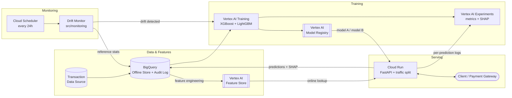

# GCP MLOps Pipeline — Real-Time Fraud Detection on Vertex AI

[](https://github.com/Milonahmed96/gcp-fraud-detection-mlops/actions)
[](https://www.python.org/downloads/release/python-3110/)
[](https://cloud.google.com/run)

A production-grade, end-to-end MLOps pipeline that detects fraudulent card transactions in real time on Google Cloud. Raw transactions land in **BigQuery**, engineered features are served at low latency from the **Vertex AI Feature Store**, two model variants (**XGBoost** and **LightGBM**) are trained and versioned on **Vertex AI** with experiment tracking, and the resulting traffic split is served from a **FastAPI** service on **Cloud Run**. Every prediction carries a **SHAP** explanation logged to Vertex AI Experiments for auditability — a hard requirement in regulated financial services. A **Cloud Scheduler** job runs a daily drift check that can trigger retraining, and **GitHub Actions** deploys to Cloud Run on every merge to `main`. The two model variants run as a live **A/B test**, compared not just on AUC and F1 but on a business cost metric that prices false negatives (missed fraud) against false positives (blocked genuine customers).

---

## Architecture



A rendered `draw.io` XML export lives in `infrastructure/` once Phase 9 completes.

---

## Tech stack

| Component | Technology | Purpose |
|---|---|---|
| Offline feature store | BigQuery | Historical features, training sets, immutable audit log of predictions |
| Online feature store | Vertex AI Feature Store (managed) | Low-latency feature lookup at inference time |
| Training | Vertex AI Custom Training | Runs XGBoost and LightGBM jobs on managed compute |
| Experiment tracking | Vertex AI Experiments | Params, metrics, SHAP artefacts per run |
| Model registry | Vertex AI Model Registry | Versioned, promotable model artefacts |
| Inference API | FastAPI + Docker | Typed request/response schema, low-latency handler |
| Serving platform | Cloud Run | Scale-to-zero HTTP serving with native traffic splitting |
| A/B routing | Cloud Run revision traffic split | Splits live traffic between the XGBoost and LightGBM revisions |
| Explainability | SHAP (TreeExplainer) | Per-prediction feature attributions, logged for audit |
| Drift monitoring | Cloud Scheduler + custom job | Daily PSI / KS check against the training reference distribution |
| CI/CD | GitHub Actions | Lint, pytest, build image, deploy to Cloud Run on merge to `main` |
| Models | XGBoost, LightGBM | The two A/B variants |
| Language | Python 3.11 | — |
| Packaging | uv | Fast, lockfile-backed dependency resolution |

---

## Repository structure

```
.
├── CLAUDE.md               # Agent instructions + engineering conventions
├── project_context.md      # Living project state, decisions log, session handoff
├── README.md               # You are here
├── pyproject.toml          # Project metadata + dependencies (uv)
├── .env.example            # Placeholder GCP config — copy to .env, never commit .env
├── .github/
│   └── workflows/          # GitHub Actions CI/CD (lint, test, build, deploy)
├── src/
│   ├── features/           # Feature engineering + BigQuery ingestion + Feature Store writes
│   ├── training/           # Vertex AI training jobs (XGBoost + LightGBM)
│   ├── evaluation/         # SHAP explainability + A/B test metrics
│   ├── inference/          # FastAPI app served on Cloud Run
│   └── monitoring/         # Drift detection + Cloud Scheduler integration
├── tests/                  # pytest unit + integration tests, mirrors src/
├── notebooks/              # EDA + experiment notebooks (never production code)
├── infrastructure/         # Terraform / gcloud scripts for GCP resource provisioning
└── data/
    └── sample/             # Small, anonymised sample data only — no real data, no credentials
```

---

## Quickstart

### Prerequisites

- A **Google Cloud account** with billing enabled (the free trial credit is sufficient for a full demo run)
- **[gcloud CLI](https://cloud.google.com/sdk/docs/install)**, authenticated: `gcloud auth login && gcloud auth application-default login`
- **[uv](https://docs.astral.sh/uv/getting-started/installation/)** for dependency management
- **Python 3.11**
- **Docker** (only needed to build the inference image locally)

### Setup

```bash
# 1. Clone
git clone https://github.com/Milonahmed96/gcp-fraud-detection-mlops.git
cd gcp-fraud-detection-mlops

# 2. Configure — copy the template and fill in your own GCP values
cp .env.example .env
$EDITOR .env

# 3. Point gcloud at the same project
gcloud config set project YOUR_GCP_PROJECT_ID

# 4. Install dependencies into a managed virtualenv
uv sync
```

`.env` is gitignored and must never be committed. Every GCP identifier is read from the environment via `python-dotenv` — nothing is hardcoded.

### Required environment variables

| Key | Example | Notes |
|---|---|---|
| `GCP_PROJECT_ID` | `fraud-detection-mlops` | Your project ID, not the display name |
| `GCP_REGION` | `europe-west2` | London — keeps data residency in the UK |
| `GCP_BUCKET_NAME` | `fraud-mlops-artifacts` | GCS bucket for model artefacts and staging |
| `VERTEX_AI_ENDPOINT` | `projects/.../endpoints/...` | Populated after the first deploy |
| `BIGQUERY_DATASET` | `fraud_features` | Offline store + prediction audit log |
| `FEATURE_STORE_ID` | `fraud_online_store` | Vertex AI Feature Store instance |
| `CLOUD_RUN_SERVICE_NAME` | `fraud-inference-api` | Target service for CI/CD deploys |

### Running locally

```bash
# Run the test suite (must pass before any merge)
uv run pytest

# Serve the inference API locally on :8080
uv run uvicorn src.inference.main:app --reload --port 8080

# Build the container exactly as Cloud Run will
docker build -t fraud-inference-api .
docker run --rm -p 8080:8080 --env-file .env fraud-inference-api
```

> **Note:** modules land phase by phase. Commands referencing `src/inference` and `src/training` become live from Phase 3 onward — see `project_context.md` for the current phase.

---

## GCP cost breakdown

Estimates for a **typical dev/demo run**: one training cycle per model variant, a Cloud Run endpoint serving light demo traffic, and a daily drift check, over one month in `europe-west2`.

| Service | Configuration | Estimated cost (USD/month) |
|---|---|---|
| Vertex AI Training | 2 jobs × ~20 min on `n1-standard-4` (~$0.22/hr) | **~$0.15** per full training cycle |
| Vertex AI Experiments | Metadata storage, a few hundred runs | **~$0.00** (metadata free; artefacts billed as GCS) |
| Cloud Run | Scale-to-zero, ~10k requests/mo, 1 vCPU / 512 MiB | **~$0.00–$2** (2M requests/mo are free-tier) |
| Vertex AI Feature Store (managed) | ~1 GB online storage + light read traffic | **~$1–$5** (online serving nodes dominate) |
| BigQuery | <1 GB storage, <10 GB scanned/mo | **~$0.00** (10 GB storage + 1 TB queries free/mo) |
| Cloud Scheduler | 1 job, daily | **~$0.00** (3 jobs free/mo) |
| Artifact Registry | ~1 GB of container images | **~$0.10** |
| Cloud Storage | ~1 GB of model artefacts | **~$0.02** |
| **Total** | | **≈ $2–$8 / month** |

**These are estimates**, taken from the [GCP pricing pages](https://cloud.google.com/pricing) and rounded generously. Actual cost varies with region, traffic, and how long the Feature Store online nodes stay provisioned — that is the single largest cost lever here. Tear the Feature Store down when not demoing:

```bash
gcloud ai feature-stores delete "$FEATURE_STORE_ID" --region="$GCP_REGION"
```

The whole project is designed to fit inside the GCP free trial credit.

---

## A/B testing

Both variants are trained on identical features and identical train/test splits, so the only meaningful difference between them is the learning algorithm. Cloud Run's native revision traffic splitting sends a configurable share of live requests to each — starting at 50/50 — and every prediction is written to BigQuery tagged with the serving variant, enabling honest offline comparison on real traffic.

| Variant | Model | Cloud Run revision |
|---|---|---|
| A | XGBoost | `fraud-inference-api-xgb` |
| B | LightGBM | `fraud-inference-api-lgbm` |

Metrics compared:

- **ROC-AUC** — ranking quality, robust to the extreme class imbalance typical of fraud data
- **PR-AUC** — the more honest headline metric when positives are <1% of rows
- **F1 / precision / recall at the operating threshold** — what the fraud ops team actually feels
- **Business cost metric** — the metric that decides the winner:

  ```
  cost = (false_negatives × mean_fraud_value) + (false_positives × cost_of_blocking_genuine_customer)
  ```

  A missed fraud costs the chargeback. A false positive costs a declined transaction and some goodwill. These are not symmetric, so accuracy-flavoured metrics alone pick the wrong model. The variant with the **lower expected cost per 1,000 transactions wins**, and the decision is reported with a bootstrap confidence interval rather than a bare point estimate.

- **p50 / p95 / p99 latency** — a model that wins on cost but blows the latency budget doesn't ship

Results are published to an A/B dashboard (Phase 8).

---

## SHAP explainability

Regulated lenders must be able to explain adverse automated decisions. Every prediction returns, alongside its fraud probability, the top contributing features and their signed SHAP attributions.

- `shap.TreeExplainer` is used for both variants — exact for tree ensembles and fast enough to sit in the request path
- The explainer is built once at training time and shipped as a model artefact, so no explainer construction happens per request
- Per-prediction attributions are logged to **Vertex AI Experiments** and mirrored into **BigQuery**, giving a queryable audit trail: *why* was transaction `X` blocked on date `Y`?
- Global feature importance (mean absolute SHAP) is recomputed each training run and compared against the previous run — a large shift in what drives the model is itself a drift signal

---

## CI/CD

`.github/workflows/` defines the pipeline (Phase 7):

**On pull request into `develop`:**
1. `ruff check` + `ruff format --check` — lint and format gates
2. `uv run pytest` — full unit and integration suite
3. Docker build (build-only, no push) — proves the image still assembles

**On merge to `main`:**
1. Everything above
2. Build and push the image to Artifact Registry, tagged with the commit SHA
3. `gcloud run deploy` to Cloud Run in `europe-west2`
4. Smoke-test the new revision's `/health` endpoint before shifting traffic
5. Shift traffic per the configured A/B split; roll back automatically if the smoke test fails

Authentication uses **Workload Identity Federation** — GitHub Actions assumes a GCP service account via OIDC. No service-account JSON key is ever stored in the repository or in GitHub secrets.

---

## Project status

| Phase | Scope | Status |
|---|---|---|
| 1 | Repository scaffold + documentation | ✅ Complete |
| 2 | Data ingestion + feature engineering | ⬜ Not started |
| 3 | Model training on Vertex AI | ⬜ Not started |
| 4 | SHAP explainability module | ⬜ Not started |
| 5 | FastAPI inference service | ⬜ Not started |
| 6 | Drift monitoring | ⬜ Not started |
| 7 | GitHub Actions CI/CD | ⬜ Not started |
| 8 | A/B test dashboard | ⬜ Not started |
| 9 | Final polish + `v1.0.0` tag | ⬜ Not started |

See `project_context.md` for the live state and decisions log.

---

## Engineering conventions

- **GitFlow:** `main` (protected, production) ← `develop` (integration) ← `feature/*`
- **Conventional commits:** `feat:`, `fix:`, `chore:`, `docs:`, `refactor:`, `test:`
- **One logical change per commit.** No monolithic commits.
- **Tests accompany every `src/` module.** `pytest` must pass before any merge.
- **No credentials in git, ever.** All config flows through `.env` → `python-dotenv`.

Full detail in [CLAUDE.md](CLAUDE.md).

---

Part of Milon Ahmed's AI Engineer portfolio. See also: [links to other portfolio projects]
